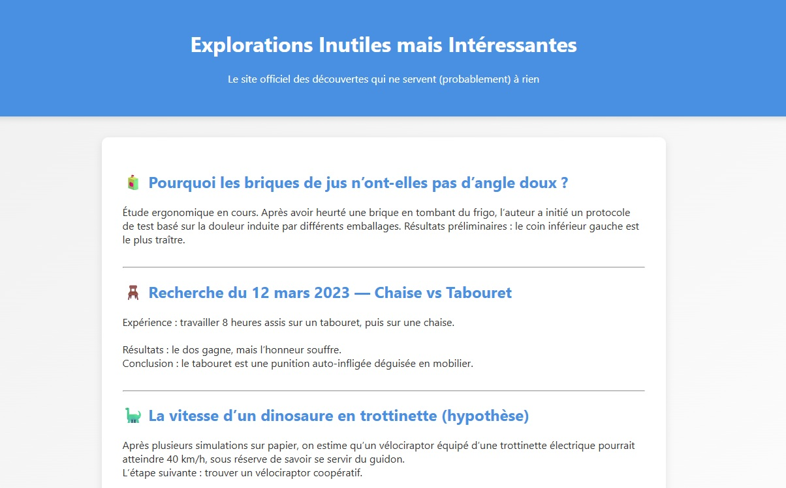

# CTF Web Serveur - Directory Traversal

## Présentation du CTF 
**ID** 3 dans **les CTFs de Cyrhades**

Trouvez le FLAG de validation en vous "balladant" dans les répertoires et fichiers du serveur.

Dans ce challenge l'objectif est de récupérer le flag qui se trouve dans un fichier de type .env de l'application.
Mais vous devez trouver l'emplacement de ce fichier, pour info nous sommes sur un site codé en NodeJS.

## Aperçu

-----------

## Installation manuel
Vous n'utilisez pas l'application **les CTFs de Cyrhades** ? C'est dommage !
Mais voici comment installer ce CTF manuellement :

> git clone https://github.com/Hack-Oeil/NODE_DIRECTORY_TRAVERSAL.git

> cd NODE_DIRECTORY_TRAVERSAL && docker compose up

